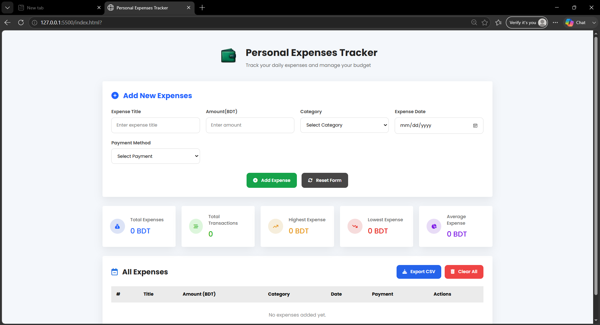

# Personal Expense Tracker (CRUD)

## Project Overview

Personal Expense Tracker is a simple CRUD (Create, Read, Update, Delete) web application built using **HTML, CSS, and JavaScript**. It helps users manage their daily expenses by adding, updating, deleting, and viewing expense records. The application also provides a summary of expenses and stores data using Local Storage.

---

## Features

* Add a new expense
* Edit existing expenses
* Update expense information
* Delete a single expense
* Clear all expenses
* Form validation
* Expense summary

  * Total Expenses
  * Total Transactions
  * Highest Expense
  * Lowest Expense
  * Average Expense
* Local Storage support
* Export expenses as a CSV file
* Responsive design

---

## Technologies Used

* HTML5
* CSS3
* JavaScript (ES6)

---

## Project Structure

```
expense-tracker/
│── index.html
│── style.css
│── script.js
│── README.md

```

---

## How to Run

1. Go to the GitHub deployment or clone the project.
2. Open the project folder.
3. Double-click **index.html** or open it in any modern web browser.
4. Start adding and managing your expenses.

---

## How to Use

1. Fill in the expense details.
2. Click **Add Expense** to save a new expense.
3. Click **Edit** to modify an expense.
4. Click **Update Expense** to save changes.
5. Click **Delete** to remove an expense.
6. Click **Clear All** to remove all expenses.
7. Click **Export CSV** to download all expense records.

---

## Screenshots



---

## Author

**Name:** Mohimenul Islam

**Course:** Full Stack Web Development with Python, Django, React & AI

**Assignment:** Personal Expense Tracker (CRUD)
